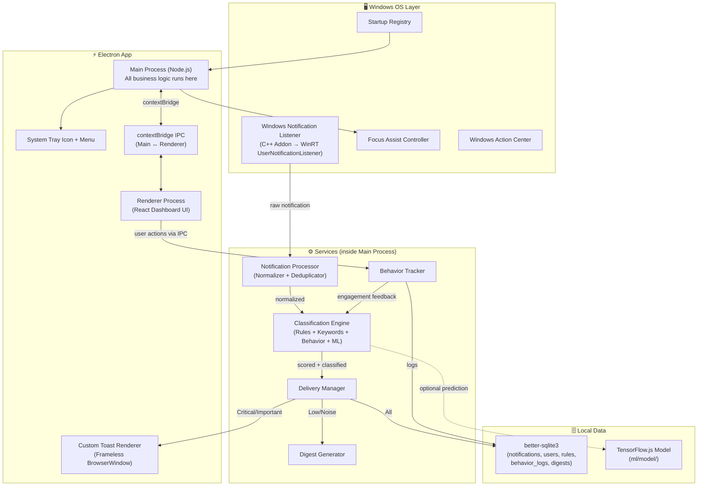
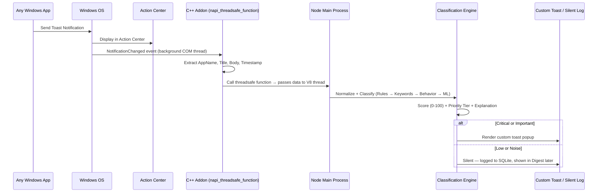

# 🔔 Smart Notification Triage v2 — Electron Desktop App

---

## Status: Phases 1–11 Complete (Web App) ✅

The web-based notification triage system is fully functional with:
- 3-layer Classification Engine (Static Rules → Keywords → Behavioral Learning)
- Real-time WebSocket delivery
- Daily Digest, Analytics Dashboard, Simulator
- Behavior tracking and learning feedback loop

**This plan covers the migration to an Electron desktop app that captures and triages REAL Windows notifications.**

---

## 1. Goal

Transform the existing web app into a **native Windows desktop application** that:

1. **Captures every real notification** from all apps on the user's Windows PC
2. **Classifies them** using the existing 3-layer engine (with an ML upgrade path)
3. **Suppresses noise** via Windows Focus Assist (with graceful fallback)
4. **Renders custom alerts** only for Critical/Important notifications
5. **Runs silently** from boot to shutdown as a System Tray app
6. **Learns and adapts** using TensorFlow.js for on-device ML training

---

## 2. Finalized Architectural Decisions

These decisions were finalized through discussion and are **not open for debate** during implementation.

| Decision | Choice | Rationale |
|----------|--------|-----------|
| **Communication** | Electron IPC via `contextBridge` | No Express server. Direct `ipcMain` ↔ `ipcRenderer` communication. Simpler, faster, more secure (no open network port) |
| **Database** | `better-sqlite3` (local) | Fully offline, zero-config, privacy-respecting. No MongoDB dependency. Database file lives next to the app |
| **WinRT Access** | Custom C++ native addon via `node-addon-api` (N-API) | No unmaintained NPM packages. Full control. Uses `napi_threadsafe_function` to safely bridge WinRT background threads to Node's V8 engine. Built with `node-gyp` |
| **ML Framework** | TensorFlow.js (Node.js) only | No Python. Runs natively in Electron's Node process. Keeps installer lean |
| **Focus Assist** | Suppress + graceful fallback to additive mode | If OS permissions unavailable or toggling fails, the app falls back to recording and scoring silently without suppressing native popups |
| **Distribution** | GitHub (open-source + GitHub Releases) | Two paths: (a) Clone & build locally, (b) Download pre-built `.exe` from Releases. README includes SmartScreen disclaimer for unsigned `.exe` |

---

## 3. System Architecture



---

## 4. How Real Notification Capture Works



> [!WARNING]
> **Apps that bypass Windows Toast API** (e.g., some games, apps using custom overlay popups) will NOT be captured. Users must enable "Use Native Notifications" in those apps' settings (Discord, Telegram, etc.).

---

## 5. Updated File & Folder Architecture

```
Notification_system/
│
├── electron/                            # Electron main process
│   ├── main.js                         # Entry point: creates window, starts services
│   ├── preload.js                      # contextBridge — exposes IPC API to renderer
│   ├── ipcHandlers.js                  # All ipcMain.handle() registrations
│   ├── tray.js                         # System tray icon + context menu
│   ├── windowManager.js                # Main window + toast window management
│   ├── autoLaunch.js                   # Register for Windows startup
│   ├── focusAssist.js                  # Focus Assist control + fallback logic
│   └── services/
│       ├── notificationProcessor.js    # Normalize raw WinRT notifications
│       └── toastRenderer.js            # Spawn frameless toast popup windows
│
├── native/                              # C++ native addon (node-addon-api)
│   ├── binding.gyp                     # node-gyp build configuration
│   ├── src/
│   │   ├── addon.cpp                   # N-API module init + exports
│   │   ├── notification_listener.cpp   # WinRT UserNotificationListener
│   │   ├── notification_listener.h     # Header
│   │   └── utils.cpp                   # WinRT string conversion helpers
│   ├── build/                          # Generated by node-gyp (gitignored)
│   └── README.md                       # Build instructions (requires VS Build Tools)
│
├── client/                              # React frontend (Electron renderer process)
│   ├── src/
│   │   ├── components/
│   │   │   ├── notifications/
│   │   │   │   └── NotificationCard.jsx
│   │   │   └── layout/
│   │   │       ├── Sidebar.jsx
│   │   │       └── Header.jsx
│   │   ├── pages/
│   │   │   ├── Dashboard.jsx
│   │   │   ├── DigestPage.jsx
│   │   │   ├── AnalyticsPage.jsx
│   │   │   ├── SettingsPage.jsx        # UPDATED — new toggles for real notifs, startup, ML
│   │   │   └── SimulatorPage.jsx
│   │   ├── context/
│   │   │   └── SocketContext.jsx       # REMOVED — replaced by IPC
│   │   ├── styles/
│   │   ├── App.jsx
│   │   └── main.jsx
│   ├── toast.html                      # Standalone HTML for custom toast popup
│   └── vite.config.js                  # UPDATED — base './' for file:// protocol
│
├── server/                              # Business logic (runs in Electron main process)
│   └── src/
│       ├── services/
│       │   ├── classificationEngine.js # UPDATED — Layer 4 (ML) added
│       │   ├── behaviorTracker.js
│       │   ├── deliveryManager.js      # UPDATED — routes to custom toast via IPC
│       │   ├── digestGenerator.js
│       │   ├── notificationSimulator.js
│       │   └── mlBridge.js             # NEW — TensorFlow.js model loader + predictor
│       ├── database/
│       │   ├── db.js                   # NEW — better-sqlite3 connection + schema init
│       │   ├── notificationRepo.js     # NEW — Notification CRUD (replaces Mongoose)
│       │   ├── userRepo.js             # NEW — User preferences
│       │   ├── ruleRepo.js             # NEW — Classification rules
│       │   ├── behaviorRepo.js         # NEW — Behavior logs
│       │   └── digestRepo.js           # NEW — Digest storage
│       ├── utils/
│       │   └── keywords.js
│       └── data/
│           └── sampleNotifications.js
│
├── ml/                                  # TensorFlow.js ML pipeline
│   ├── model/                          # Trained model artifacts (SavedModel format)
│   │   └── classifier_model/
│   ├── train.js                        # Training script
│   ├── preprocess.js                   # Feature extraction from behavior data
│   └── README.md                       # ML pipeline documentation
│
├── shared/
│   └── constants.js                    # UPDATED — new source types, IPC channel names
│
├── package.json                         # UPDATED — Electron + native build scripts
├── electron-builder.yml                 # Installer/packaging configuration
└── README.md                            # UPDATED — setup, SmartScreen disclaimer
```

---

## 6. Development Phases (Strategy A — Motivation-First Order)

> [!NOTE]
> **Strategy A**: Build easy wins first for visible progress, tackle the hardest part (C++ addon) after everything else works. At every phase you have a fully working, demo-able app.

---

### Phase 12: Electron Shell + SQLite Migration (Day 33–42)

> **Goal**: The entire existing web app runs as a desktop application with a local SQLite database. No browser needed. Zero feature regression.

#### 12A — Electron Shell + IPC

```
□ Install dependencies:
    - electron, electron-builder (dev)
    - electron-store (for app-level settings like window position)
□ Create electron/main.js:
    - Create BrowserWindow, load Vite dev server in dev / built files in prod
    - Initialize all services (classification engine, behavior tracker, etc.)
    - Initialize SQLite database connection
□ Create electron/preload.js (contextBridge):
    - Expose a secure electronAPI object to the renderer:
        window.electronAPI = {
            // Notifications
            getNotifications: (filters) => ipcRenderer.invoke('notifications:getAll', filters),
            updateNotificationStatus: (id, status) => ipcRenderer.invoke('notifications:updateStatus', id, status),
            clearAllNotifications: () => ipcRenderer.invoke('notifications:clearAll'),
            onNewNotification: (callback) => ipcRenderer.on('notifications:new', callback),

            // Simulator
            startSimulation: (speedMs) => ipcRenderer.invoke('simulator:start', speedMs),
            stopSimulation: () => ipcRenderer.invoke('simulator:stop'),
            sendOneNotification: () => ipcRenderer.invoke('simulator:sendOne'),

            // Digest
            getLatestDigest: () => ipcRenderer.invoke('digest:getLatest'),
            getAllDigests: () => ipcRenderer.invoke('digest:getAll'),
            generateDigest: () => ipcRenderer.invoke('digest:generate'),

            // Rules
            getRules: () => ipcRenderer.invoke('rules:getAll'),
            createRule: (rule) => ipcRenderer.invoke('rules:create', rule),
            updateRule: (id, updates) => ipcRenderer.invoke('rules:update', id, updates),
            deleteRule: (id) => ipcRenderer.invoke('rules:delete', id),

            // Analytics
            getAnalyticsSummary: () => ipcRenderer.invoke('analytics:summary'),
            getAnalyticsTrends: () => ipcRenderer.invoke('analytics:trends'),
            getBehaviorReport: () => ipcRenderer.invoke('analytics:behavior'),

            // Settings
            getUserPreferences: () => ipcRenderer.invoke('user:getPreferences'),
            updateUserPreferences: (prefs) => ipcRenderer.invoke('user:updatePreferences', prefs),
        }
□ Create electron/ipcHandlers.js:
    - Register all ipcMain.handle() calls that map to database/service operations
    - Each handler calls the appropriate repo function (replaces Express controllers)
□ Update package.json scripts:
    - "electron:dev" → runs Vite + Electron concurrently
    - "electron:build" → Vite build + electron-builder package
□ Update vite.config.js:
    - Set base: './' (for file:// protocol in production)
    - Ensure build output goes to client/dist/
```

#### 12B — MongoDB → SQLite Migration

```
□ Install better-sqlite3
□ Create server/src/database/db.js:
    - Initialize better-sqlite3 connection
    - Create all tables on first run (schema auto-migration):

    CREATE TABLE notifications (
        id INTEGER PRIMARY KEY AUTOINCREMENT,
        user_id INTEGER NOT NULL,
        source_app TEXT NOT NULL,
        category TEXT NOT NULL,
        title TEXT NOT NULL,
        body TEXT NOT NULL,
        icon TEXT,
        timestamp DATETIME DEFAULT CURRENT_TIMESTAMP,
        deep_link TEXT,
        action_buttons TEXT,  -- JSON array stored as text
        priority TEXT,
        score INTEGER,
        status TEXT DEFAULT 'unread',
        explanation TEXT,
        is_real INTEGER DEFAULT 0,  -- 1 = captured from Windows, 0 = simulated
        created_at DATETIME DEFAULT CURRENT_TIMESTAMP
    );

    CREATE TABLE users (
        id INTEGER PRIMARY KEY AUTOINCREMENT,
        username TEXT UNIQUE NOT NULL,
        email TEXT UNIQUE NOT NULL,
        digest_time TEXT DEFAULT '08:00',
        focus_mode TEXT DEFAULT 'open',
        timezone TEXT DEFAULT 'UTC',
        created_at DATETIME DEFAULT CURRENT_TIMESTAMP
    );

    CREATE TABLE rules (
        id INTEGER PRIMARY KEY AUTOINCREMENT,
        user_id INTEGER NOT NULL,
        type TEXT NOT NULL,       -- 'app', 'category', 'keyword'
        value TEXT NOT NULL,
        priority TEXT NOT NULL,
        is_active INTEGER DEFAULT 1,
        created_at DATETIME DEFAULT CURRENT_TIMESTAMP
    );

    CREATE TABLE behavior_logs (
        id INTEGER PRIMARY KEY AUTOINCREMENT,
        user_id INTEGER NOT NULL,
        notification_id INTEGER NOT NULL,
        source_app TEXT NOT NULL,
        category TEXT NOT NULL,
        original_priority TEXT,
        action TEXT NOT NULL,
        action_timestamp DATETIME DEFAULT CURRENT_TIMESTAMP,
        response_time_ms INTEGER
    );

    CREATE TABLE digests (
        id INTEGER PRIMARY KEY AUTOINCREMENT,
        user_id INTEGER NOT NULL,
        generated_at DATETIME DEFAULT CURRENT_TIMESTAMP,
        period_from DATETIME,
        period_to DATETIME,
        summary TEXT,           -- JSON stored as text
        sections TEXT           -- JSON stored as text
    );

□ Create repository files (replace Mongoose models + Express controllers):
    - server/src/database/notificationRepo.js
    - server/src/database/userRepo.js
    - server/src/database/ruleRepo.js
    - server/src/database/behaviorRepo.js
    - server/src/database/digestRepo.js
    Each repo exports functions like:
        getAll(filters), getById(id), create(data), update(id, data), delete(id)
    Using better-sqlite3 prepared statements for performance
□ Create a seed function inside db.js:
    - Inserts default user + default rules on first run (replaces npm run seed)
□ Update all services to use repos instead of Mongoose:
    - classificationEngine.js → no change (doesn't touch DB directly)
    - behaviorTracker.js → use behaviorRepo
    - deliveryManager.js → use notificationRepo + IPC emit instead of Socket.io
    - digestGenerator.js → use notificationRepo + digestRepo
    - notificationSimulator.js → no change (just generates data)
□ Remove all Mongoose/MongoDB dependencies:
    - Remove mongoose from package.json
    - Delete server/src/config/db.js (MongoDB connection)
    - Delete server/src/models/ directory
    - Delete server/src/controllers/ directory (replaced by ipcHandlers)
    - Delete server/src/routes/ directory (replaced by IPC)
□ Update React frontend — replace ALL fetch() calls with IPC:
    - Dashboard.jsx: fetch('/api/notifications') → window.electronAPI.getNotifications()
    - DigestPage.jsx: fetch('/api/digests/...') → window.electronAPI.getLatestDigest()
    - AnalyticsPage.jsx: fetch('/api/analytics/...') → window.electronAPI.getAnalyticsSummary()
    - SimulatorPage.jsx: fetch('/api/simulator/...') → window.electronAPI.startSimulation()
    - SettingsPage.jsx: fetch('/api/rules/...') → window.electronAPI.getRules()
    - Remove SocketContext.jsx — replace socket.on() with electronAPI.onNewNotification()
□ Update shared/constants.js:
    - Add IPC_CHANNELS object with all channel names
    - Remove SOCKET_EVENTS (no longer needed)
```

#### Verification (Phase 12)
```
□ App launches as an Electron window showing the React dashboard
□ Simulator works — sends notifications, they appear in Live Feed
□ Dismiss/Archive works — behavior is logged to SQLite
□ Digest generation works
□ Analytics page shows correct data from SQLite
□ Rules CRUD works
□ Settings changes persist across app restart
□ ZERO regressions from the web app version
```

---

### Phase 13: System Tray & Auto-Launch (Day 43–45)

> **Goal**: The app behaves like a native Windows utility — always running, unobtrusive.

```
□ Create electron/tray.js:
    - System tray icon (notification bell .ico, 16x16 and 32x32)
    - Context menu items:
        - "Show Dashboard" → shows/focuses main window
        - "Focus Mode" → submenu: Open, Work, Personal, DND
        - Separator
        - "Launch on Startup" → toggleable checkbox
        - "Quit" → actually exits the app
    - Left-click on tray icon → toggle main window visibility
    - Tray icon badge: different icon when unread Critical notifications exist
□ Create electron/autoLaunch.js:
    - Use app.setLoginItemSettings({ openAtLogin: true })
    - Store preference in electron-store
    - Add "Launch on Startup" toggle to Settings page
□ Implement "close to tray" behavior:
    - Window 'close' event → win.hide() instead of app.quit()
    - App only quits from: Tray → Quit, or Ctrl+Q
    - Show a one-time tooltip: "App minimized to tray" (first time only)
□ Create tray icon assets:
    - bell_default.ico (normal state)
    - bell_alert.ico (has unread Critical)
    - Generate using generate_image tool or find open-source icon
□ Update main.js:
    - Initialize tray after app is ready
    - Handle single-instance lock (prevent opening multiple copies)
    - app.requestSingleInstanceLock() → if second instance, focus existing window
```

#### Verification (Phase 13)
```
□ Close window → app keeps running in system tray
□ Click tray icon → window reappears
□ Right-click tray → context menu with all options
□ Enable "Launch on Startup" → reboot → app starts in tray
□ Second launch attempt → focuses existing window instead of opening new one
□ Run simulator → Critical notification → tray icon changes to alert state
```

---

### Phase 14: Custom Toast Rendering (Day 46–50)

> **Goal**: Beautiful custom notification popups replace generic Windows toasts. Triggered by the Simulator for now (real notifications come in Phase 15).

```
□ Create client/toast.html:
    - Standalone HTML page (not part of React app)
    - Premium glassmorphism design matching app theme
    - Layout:
        [App Icon]  [Title]                    [×]
                    [Body text (2 lines max)]
                    [sourceApp] [Priority Badge] [Score]
        [Dismiss]  [Snooze]                [Open App]
    - CSS animations: slide-in from top-right, fade-out on dismiss
    - Auto-dismiss countdown bar (8 seconds, configurable)
    - Click-to-expand for long notification text
    - Receives notification data from main process via IPC
    - Sends user action (dismiss/open/snooze) back via IPC
□ Create electron/services/toastRenderer.js:
    - spawnToast(notificationData):
        - Creates a small frameless, always-on-top BrowserWindow
        - Size: ~380×140px
        - Position: top-right corner of primary display
        - Transparent background (for rounded corners + glassmorphism)
        - Loads toast.html with notification data
    - Stack management:
        - If multiple toasts active, stack vertically with 8px gap
        - Maximum 3 visible toasts (oldest auto-dismissed if 4th arrives)
    - Auto-close: after timeout, window destroys itself
    - Sound: optional system notification sound for Critical
□ Create electron/toastPreload.js:
    - Separate preload for toast windows
    - Exposes: getNotificationData(), sendAction(action)
□ Update electron/ipcHandlers.js:
    - When deliveryManager emits a Critical/Important notification:
        - Send to renderer via webContents.send('notifications:new', notif)
        - AND spawn a toast window via toastRenderer.spawnToast(notif)
□ Wire toast actions back to behavior tracking:
    - User clicks "Dismiss" on toast → behaviorTracker.logAction('dismissed')
    - User clicks "Open" on toast → behaviorTracker.logAction('opened')
    - Toast auto-dismisses (timeout) → behaviorTracker.logAction('ignored')
    - User clicks "Snooze" → re-queue notification for X minutes later
□ Update deliveryManager.js:
    - Remove Socket.io emit logic
    - Add: notify main process to spawn toast for Critical/Important
    - Low/Noise: save to SQLite silently (no toast, no IPC to renderer)
```

#### Verification (Phase 14)
```
□ Go to Simulator → Send One → Critical notification → custom toast appears top-right
□ Toast shows correct title, body, app name, priority badge, score
□ Toast auto-dismisses after 8 seconds
□ Click "Dismiss" on toast → notification marked as dismissed in DB
□ Send 4 rapid notifications → only 3 toasts visible, stacked properly
□ Toast animation is smooth (slide-in, fade-out)
□ Low/Noise notifications from Simulator → NO toast appears
```

> [!IMPORTANT]
> **The toast must be MORE beautiful than native Windows toasts.** Glassmorphism, smooth animations, priority-colored accents. This is the primary UX differentiator.

---

### Phase 15: C++ Native Addon — Windows Notification Listener (Day 51–60)

> **Goal**: Capture real Windows notifications using a custom C++ addon that interfaces with the WinRT `UserNotificationListener` API.

> [!WARNING]
> **This is the hardest phase.** Requires C++ knowledge, Visual Studio Build Tools, and Windows SDK. Budget extra time for debugging.

#### Prerequisites
```
□ Install Visual Studio Build Tools 2022 (with "Desktop development with C++" workload)
□ Ensure Windows 10 SDK is installed (10.0.19041.0 or later)
□ Verify node-gyp works: npx node-gyp configure
```

#### C++ Addon Development
```
□ Create native/binding.gyp:
    - Target: "win_notification_listener"
    - Sources: src/addon.cpp, src/notification_listener.cpp, src/utils.cpp
    - Include dirs: node-addon-api headers
    - Libraries: runtimeobject.lib (for WinRT)
    - Compiler flags: /std:c++17, /await (for WinRT coroutines)
    - Define: NAPI_VERSION=8
□ Create native/src/notification_listener.h:
    - Class WinNotificationListener:
        - Initialize(): request UserNotificationAccess, subscribe to events
        - Shutdown(): unsubscribe, clean up COM
        - Private: napi_threadsafe_function reference for safe callback to JS
□ Create native/src/notification_listener.cpp:
    - Initialize WinRT (RoInitialize / winrt::init_apartment)
    - Create UserNotificationListener instance
    - Request UserNotificationListenerAccessStatus (triggers OS permission prompt)
    - Subscribe to NotificationChanged event
    - On each event:
        - Get UserNotification object
        - Extract: AppInfo.DisplayName, Notification.Visual.GetBinding().GetTextElements()
        - Convert HSTRING to std::string
        - Create a JS-safe data struct { appName, title, body, timestamp, notifId }
        - Call napi_threadsafe_function to pass data to the V8 thread
    - Handle errors: access denied, COM errors, null notifications
□ Create native/src/addon.cpp:
    - Module init: exports.Set("startListening", ...), exports.Set("stopListening", ...)
    - startListening(callback): stores JS callback, creates napi_threadsafe_function, calls Initialize()
    - stopListening(): calls Shutdown(), releases threadsafe function
□ Create native/src/utils.cpp:
    - HStringToStdString(): convert WinRT HSTRING to std::string
    - FormatTimestamp(): convert Windows FILETIME to ISO 8601 string
□ Add build scripts to package.json:
    - "native:build": "cd native && node-gyp rebuild"
    - "native:clean": "cd native && node-gyp clean"
□ Create native/README.md:
    - Prerequisites: Visual Studio Build Tools, Windows SDK
    - Build command: npm run native:build
    - Troubleshooting common node-gyp errors
```

#### Integration with Electron
```
□ Create electron/services/winNotificationListener.js (JS wrapper):
    - Load the native addon: require('../../native/build/Release/win_notification_listener')
    - Wrap in try/catch (graceful fallback if addon not built)
    - Expose: start(onNotification), stop()
    - The onNotification callback receives the raw data from C++
□ Create electron/services/notificationProcessor.js:
    - Normalize raw Windows notification into our standard format:
        {
            sourceApp: rawData.appName,
            category: inferCategoryFromApp(rawData.appName),
            title: rawData.title,
            body: rawData.body,
            icon: getIconForApp(rawData.appName),
            timestamp: rawData.timestamp,
            metadata: { isRealNotification: true, windowsNotifId: rawData.notifId }
        }
    - App-to-category mapping table:
        Chrome/Edge/Brave → 'other'
        Outlook/Mail → 'productivity'
        WhatsApp/Telegram/Discord/Teams → 'messaging'
        Bank apps / UPI → 'finance'
        Unknown → 'other'
    - Deduplication: skip if same notifId processed in last 5 seconds (Map cache)
□ Wire into the main pipeline:
    - notificationProcessor → classificationEngine.classify() → deliveryManager
    - Same pipeline as Simulator, just different input source
□ Add "Capture Real Notifications" toggle in Settings:
    - Default: OFF (user must opt-in)
    - When toggled ON for first time: show instructions about Windows permission
    - If addon not built: show message "Native addon not compiled. See native/README.md"
□ Handle Windows permission flow:
    - On first start with listener enabled, Windows shows permission prompt
    - If user denies: show in-app guide to enable via Settings → System → Notifications
    - Store permission status, don't re-prompt unnecessarily
```

#### Focus Assist Integration
```
□ Create electron/focusAssist.js:
    - Attempt to programmatically toggle Windows Focus Assist:
        - Use native addon or PowerShell command to enable "Priority Only" mode
    - Graceful fallback:
        - If toggling fails (insufficient permissions, unsupported OS version):
            - Log warning: "Focus Assist control unavailable, running in additive mode"
            - Set appMode = 'additive' (both native and custom popups appear)
        - If toggling succeeds:
            - Set appMode = 'suppressive' (only custom popups appear)
    - Map Focus Modes to behavior:
        OPEN → Focus Assist OFF (native popups + our custom toasts)
        WORK → Focus Assist ON, suppress all, our app shows Critical only
        PERSONAL → Focus Assist ON, suppress all, our app shows Critical + Important
        DND → Focus Assist ON, suppress all, our app shows nothing
    - Show current mode status in Settings page
    - Expose: enable(), disable(), getStatus(), getFallbackMode()
```

#### Verification (Phase 15)
```
□ npm run native:build → compiles without errors
□ Enable "Capture Real Notifications" in Settings
□ Windows permission prompt appears → grant access
□ Open Chrome → get a web notification → appears in our Live Feed
□ Receive WhatsApp desktop notification → captured and classified correctly
□ System notification (Windows Update) → captured
□ Custom toast appears for Critical real notification
□ Low/Noise real notification → no toast, appears in Digest
□ Rapid burst of 20+ real notifications → no duplicates, no crashes
□ Disable listener → stop capturing (Simulator still works)
□ Test without native addon compiled → app works fine with Simulator only
□ Test Focus Assist: if available → native popups suppressed
□ Test Focus Assist fallback: if unavailable → app still works (additive mode)
```

---

### Phase 16: TensorFlow.js ML Layer (Day 61–66)

> **Goal**: Add an optional 4th classification layer that uses a locally-trained neural network to predict notification priority from user behavior patterns.

```
□ Create server/src/services/mlBridge.js:
    - loadModel(): load TF.js SavedModel from ml/model/classifier_model/
    - predict(features): run inference, return { priority, confidence }
    - isModelAvailable(): check if trained model exists
    - Graceful fallback: if no model loaded → return null (engine uses heuristics)
□ Update classificationEngine.js — Add Layer 4:
    - Layer 1: Static Rules (highest precedence, unchanged)
    - Layer 2: Keyword & Category Analysis (unchanged)
    - Layer 3: Behavioral Heuristics (unchanged)
    - Layer 4: ML Prediction (NEW):
        If ML confidence > 0.85 → use ML prediction
        If ML confidence 0.50–0.85 → blend with heuristic score (weighted avg)
        If ML confidence < 0.50 → ignore ML, use heuristic result
    - Update explanation: "🤖 ML predicts: important (92% confidence)"
□ Create ml/preprocess.js — Feature extraction:
    - Extract from BehaviorLog + Notification data:
        Text features: word_count, has_url, has_number, has_emoji
        App features: source_app (one-hot), category (one-hot)
        Temporal: hour_of_day, day_of_week
        Behavioral: app_engagement_score, category_engagement_score,
                    avg_response_time_for_app, dismiss_rate_for_app
    - Output: normalized feature vector (array of floats)
□ Create ml/train.js — Training script:
    - Load all BehaviorLogs from SQLite
    - For each log: extract features + derive label from user action:
        opened/clicked → "user cared" → Important/Critical
        dismissed/ignored → "user didn't care" → Low/Noise
    - Build model:
        Input: feature vector (N features)
        Hidden: Dense(64, relu) → Dense(32, relu) → Dropout(0.2)
        Output: Dense(4, softmax) → [critical, important, low, noise]
    - Train with Adam optimizer, categorical crossentropy loss
    - Save to ml/model/classifier_model/ (TF.js LayersModel format)
    - Log: epochs, loss, accuracy, validation accuracy
    - Minimum data requirement: 50+ behavior logs before training allowed
□ Add ML controls to Settings page:
    - Status display:
        "ML Model: Active (trained on 247 interactions, 91% accuracy)"
        "ML Model: Not trained yet (need 50+ interactions, currently have 12)"
        "ML Model: Disabled (using heuristics only)"
    - "Train Model" button:
        Triggers ml/train.js via IPC
        Shows progress modal with epoch/loss/accuracy
    - "Enable ML" toggle (default: off until first training)
    - Option: Auto-retrain weekly via node-cron
□ Add IPC handlers for ML:
    - 'ml:getStatus' → returns model status, interaction count, accuracy
    - 'ml:train' → runs training, streams progress back
    - 'ml:enable' / 'ml:disable' → toggle ML layer
```

> [!NOTE]
> **The ML layer is 100% optional.** The system works perfectly without it. ML is a transparent upgrade that only activates when the user has enough data AND the model is confident enough. The app is useful from day 1 (heuristics) and gets smarter over time (ML).

#### Verification (Phase 16)
```
□ App works perfectly with no trained model (pure heuristics)
□ Interact with 50+ notifications (mix of dismiss/open/archive)
□ Click "Train Model" → training completes, accuracy shown
□ Send new notifications → explanation includes ML prediction
□ ML gives low confidence on unknown app → falls back to heuristics
□ Disable ML toggle → system reverts to pure heuristics
□ Delete model file → system gracefully falls back, no crash
```

---

### Phase 17: Packaging & Distribution (Day 67–70)

> **Goal**: Package the app into a professional Windows installer and distribute via GitHub.

```
□ Create electron-builder.yml:
    appId: com.smartnotification.triage
    productName: Smart Notification Triage
    directories:
        output: dist
    win:
        target: nsis
        icon: assets/icon.ico
    nsis:
        oneClick: false
        allowToChangeInstallationDirectory: true
        createDesktopShortcut: true
        createStartMenuShortcut: true
    extraResources:
        - native/build/Release/*.node    # Include compiled C++ addon
        - ml/model/**/*                  # Include trained ML model (if exists)
    files:
        - electron/**/*
        - client/dist/**/*
        - server/**/*
        - shared/**/*
        - "!**/node_modules/*/{CHANGELOG.md,README.md}"
□ Generate app icons:
    - 256x256 .ico for the app (use generate_image tool)
    - 16x16 and 32x32 for tray icons
    - Installer header/sidebar images (164×314 and 150×57)
□ Configure production build pipeline:
    - npm run build:
        1. Vite builds React → client/dist/
        2. node-gyp rebuilds native addon for production
        3. electron-builder packages everything → dist/SmartNotificationTriage-Setup.exe
□ Handle dev vs prod mode in main.js:
    - Dev: mainWindow.loadURL('http://localhost:5173')
    - Prod: mainWindow.loadFile('client/dist/index.html')
□ Update README.md with:
    - Project description and screenshots
    - Two distribution paths:
        a) **Open-source build** (for developers):
            Prerequisites: Node.js, Visual Studio Build Tools, Windows SDK
            git clone → npm install → npm run native:build → npm run electron:dev
        b) **Pre-built installer** (for users):
            Download .exe from GitHub Releases → install → run
    - SmartScreen disclaimer:
        > ⚠️ **Windows SmartScreen Warning**: Since this app is not code-signed,
        > Windows may show an "unrecognized app" warning when you first run the
        > installer. Click "More info" → "Run anyway" to proceed. This is normal
        > for unsigned open-source software.
    - Setup instructions for enabling Windows notification access
    - Known limitations (apps that bypass Windows Toast API)
□ Set up GitHub Releases:
    - Create release workflow (manual or GitHub Actions)
    - Upload .exe installer as release asset
    - Write release notes with changelog
□ Optimize bundle size:
    - Exclude devDependencies from production
    - Prune unnecessary files from asar archive
    - Target: installer < 200MB
```

#### Verification (Phase 17)
```
□ npm run build → produces .exe installer without errors
□ Install .exe on a clean Windows machine (no Node.js installed)
□ App launches, shows dashboard
□ All features work: Simulator, Live Feed, Digest, Analytics, Settings
□ Enable real notifications → works (if native addon is bundled)
□ App registers for startup → survives reboot
□ Uninstaller removes all files + startup entry cleanly
□ Push to GitHub → README renders correctly with all instructions
□ Download .exe from GitHub Releases → install → works
```

---

## 7. Milestone Summary

| After Phase | What You Have |
|------------|--------------|
| **12** | Complete desktop app. SQLite database. All existing features work via IPC. No browser needed |
| **13** | ↑ plus system tray, auto-launch on boot, close-to-tray. Feels like a real Windows utility |
| **14** | ↑ plus beautiful custom toast popups (triggered by Simulator). Visual wow factor |
| **15** | ↑ plus **REAL notification capture** from all Windows apps. Focus Assist suppression (with fallback) |
| **16** | ↑ plus on-device ML training. System gets smarter over time. "🤖 ML predicts: noise (94%)" |
| **17** | ↑ packaged as a professional `.exe` installer. Published on GitHub. Ready for the world |

---

## 8. Success Metrics

| Metric | Target |
|--------|--------|
| **Real notification capture rate** | >95% of Action Center notifications captured |
| **Classification accuracy on real data** | >85% of notifications land in correct tier |
| **Custom toast render latency** | Toast appears within 500ms of real notification |
| **Memory footprint** | <200MB RAM while idle in system tray |
| **Startup time** | App ready within 3 seconds of launch |
| **ML model accuracy** (after 200+ interactions) | >80% on held-out test set |
| **Zero missed Critical** | No Critical notification is ever silently suppressed |
| **Installer size** | <200MB |

---

> [!TIP]
> **Phase 12 is the safest starting point.** It's purely about wrapping the existing app in Electron + migrating the database. No new features, no C++, no OS-level APIs. Once that works perfectly, each phase adds exactly one new capability. You always have a working app.
