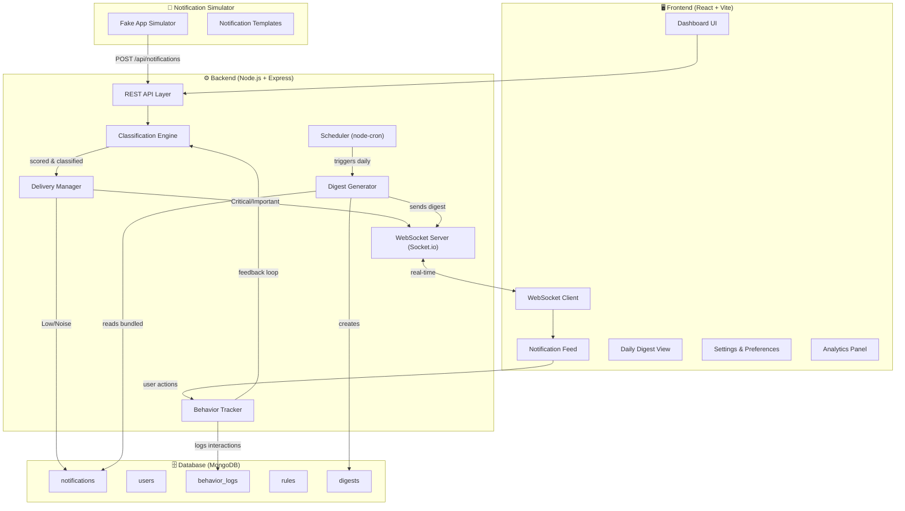
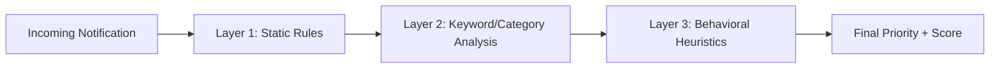
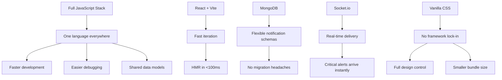

# 🔔 Smart Notification Triage — Complete Project Documentation

---

## 1. Problem Statement

Modern applications send push notifications for everything — marketing promotions, minor updates, social media activity, and critical security alerts — all with **identical priority and presentation**. The result:

- **Users are overwhelmed** → They start ignoring ALL notifications, including critical ones
- **Important alerts get buried** → A bank fraud alert looks the same as a "50% off shoes" promo
- **App uninstalls spike** → 28% of users uninstall apps specifically due to notification spam
- **Notification permissions get revoked** → Users turn off notifications entirely, killing the channel

> [!IMPORTANT]
> The root cause isn't "too many notifications" — it's **lack of intelligent triage**. Users need a system that separates signal from noise automatically.

---

## 2. The Solution: Smart Notification Triage

A web-based system that:

1. **Classifies** every notification into priority tiers (Critical → Noise)
2. **Learns** from user behavior (what they open, dismiss, ignore)
3. **Bundles** low-priority notifications into a beautiful **Daily Digest**
4. **Delivers** only time-sensitive, critical alerts as real-time interruptions
5. **Gives users control** with Focus Modes, per-app rules, and scheduling

### Why a Web App?

| Reason | Explanation |
|--------|-------------|
| **Cross-platform** | Works on any device with a browser — Windows, Mac, Linux, mobile |
| **No installation barrier** | Users visit a URL. No downloads, no permissions, no friction |
| **Easy to demo & share** | Send a link to anyone — recruiters, users, collaborators |
| **Convertible to .exe** | Can be wrapped with Electron/Tauri later for desktop app |
| **Faster development** | Web technologies have the richest ecosystem and fastest iteration cycle |
| **Real-time capable** | WebSockets enable instant notification delivery, just like native apps |

---

## 3. System Architecture

### 3.1 High-Level Architecture



### 3.2 Component Breakdown (Detailed)

---

#### 🔵 Component 1: Notification Ingestion Layer

**What it does:** Receives notifications from external sources (or our simulator) and normalizes them into a standard format.

**Why it exists:** Real-world notifications come from hundreds of different apps with different data structures. This layer standardizes everything into one unified format before classification.

**How it works:**
1. Receives raw notification via `POST /api/notifications`
2. Validates the payload (source app, title, body, category)
3. Attaches metadata (timestamp, unique ID)
4. Passes the normalized notification to the Classification Engine

**Notification Data Model:**
```json
{
  "id": "notif_abc123",
  "sourceApp": "BankX",
  "category": "security",
  "title": "Suspicious login detected",
  "body": "Someone logged into your account from Mumbai, India",
  "icon": "🏦",
  "timestamp": "2026-06-06T12:30:00Z",
  "metadata": {
    "deepLink": "/security/alerts/123",
    "actionButtons": ["Review Activity", "Lock Account"]
  },
  "priority": null,
  "score": null,
  "status": "unprocessed"
}
```

---

#### 🔴 Component 2: Classification Engine

**What it does:** Assigns a priority tier and urgency score (0–100) to every notification.

**Why it exists:** This is the brain of the system. Without intelligent classification, we're just building another notification inbox.

**How it works (3-layer approach):**



**Layer 1 — Static Rules (User-defined):**
- User creates rules: "All notifications from BankX = Critical"
- Per-app, per-category overrides
- Whitelist/blacklist specific apps
- These always take highest precedence

**Layer 2 — Keyword & Category Analysis:**
- Scans notification title + body for urgency keywords
- Keyword sets per tier:

| Tier | Keywords / Signals |
|------|-------------------|
| 🔴 Critical | "security", "fraud", "unauthorized", "emergency", "payment failed", "expiring in", "OTP" |
| 🟡 Important | "message from", "reminder", "delivery", "appointment", "reply", "mentioned you" |
| 🔵 Low | "sale", "discount", "new feature", "weekly update", "trending", "you might like" |
| ⚪ Noise | "we miss you", "rate us", "haven't opened", "complete your profile" |

- Category mapping: `security` → Critical, `marketing` → Low, `social` → Important, etc.

**Layer 3 — Behavioral Heuristics (Learning):**
- Tracks user interaction patterns over time
- If user consistently dismisses notifications from App X → auto-downgrade
- If user always opens notifications of category Y → auto-upgrade
- Engagement score formula:

```
engagement_score = (opens × 3 + clicks × 2) / (total_received) × 100
```

- High engagement (>70) → upgrade priority
- Low engagement (<20) → downgrade priority
- This creates the "learning" effect without needing ML

**Priority Tiers & Score Ranges:**

| Tier | Score Range | Delivery Method |
|------|-------------|-----------------|
| 🔴 Critical | 80–100 | Immediate real-time push |
| 🟡 Important | 50–79 | Delivered, but gently (no sound, batched hourly) |
| 🔵 Low | 20–49 | Bundled into Daily Digest |
| ⚪ Noise | 0–19 | Suppressed (viewable in archive) |

---

#### 🟢 Component 3: Delivery Manager

**What it does:** Decides WHEN and HOW each classified notification is delivered to the user.

**Why it exists:** Classification alone isn't enough — a Critical alert at 3 AM might still be wrong to deliver with full sound. The Delivery Manager adds timing intelligence.

**Delivery strategies:**

| Priority | Strategy | Implementation |
|----------|----------|----------------|
| Critical | Instant push | WebSocket emit → browser notification + in-app alert |
| Important | Batched delivery | Queue → deliver every 30-60 min or on next app open |
| Low | Daily Digest | Queue → aggregate → generate digest at scheduled time |
| Noise | Archive only | Store in DB, accessible in "Archive" section, no delivery |

**Focus Modes (affects delivery):**
- **Work Mode:** Only Critical gets through. Everything else queued.
- **Personal Mode:** Critical + Important get through.
- **Do Not Disturb:** Nothing gets through. Everything queued for later.
- **Open Mode:** Everything delivered as classified (default).

---

#### 🟡 Component 4: Daily Digest Generator

**What it does:** Aggregates all Low-priority notifications from the past 24 hours into a structured, beautiful summary.

**Why it exists:** This is the **killer feature** — the thing that makes users love the system. Instead of 47 random pings, they get ONE beautiful summary.

**Digest structure:**
```json
{
  "id": "digest_20260606",
  "userId": "user_001",
  "generatedAt": "2026-06-06T08:00:00Z",
  "period": { "from": "2026-06-05T08:00:00Z", "to": "2026-06-06T08:00:00Z" },
  "summary": {
    "totalNotifications": 47,
    "byCategory": {
      "social": 18,
      "marketing": 15,
      "updates": 9,
      "other": 5
    },
    "topApps": ["Instagram", "Flipkart", "YouTube"],
    "suppressedCount": 12
  },
  "sections": [
    {
      "category": "Social",
      "icon": "👥",
      "count": 18,
      "highlights": ["3 new followers on Instagram", "5 likes on your post"],
      "notifications": ["...array of full notification objects..."]
    }
  ]
}
```

**Scheduling:** Uses `node-cron` to trigger digest generation at user-preferred time (default: 8:00 AM).

---

#### 🟣 Component 5: Behavior Tracker

**What it does:** Records every user interaction with notifications and feeds this data back to the Classification Engine.

**Why it exists:** This is what makes the system "smart" — it learns. Without behavior tracking, we just have static rules.

**Events tracked:**

| Event | Weight | Meaning |
|-------|--------|---------|
| `opened` | +3 | User actively cared about this notification |
| `clicked_action` | +2 | User engaged with a CTA button |
| `dismissed` | -1 | User saw it but didn't care |
| `ignored` | -2 | User didn't even interact (after 24h) |
| `snoozed` | +1 | User cares but not right now |

**Behavior Log Data Model:**
```json
{
  "userId": "user_001",
  "notificationId": "notif_abc123",
  "sourceApp": "Instagram",
  "category": "social",
  "originalPriority": "important",
  "action": "dismissed",
  "actionTimestamp": "2026-06-06T14:22:00Z",
  "responseTimeMs": 3200
}
```

**Feedback loop:** Every 24 hours (or on-demand), the system recalculates engagement scores per app and per category, then adjusts the Classification Engine's scoring weights.

---

#### 🔵 Component 6: Notification Simulator

**What it does:** Generates realistic fake notifications from simulated apps so the system has data to work with.

**Why it exists:** Since we're building a web app (not intercepting real device notifications), we need realistic test data. The simulator makes the demo feel alive and real.

**Simulated apps & notification types:**

| App | Category | Example Notifications |
|-----|----------|----------------------|
| BankX | Security/Finance | "OTP: 482910", "₹5,000 debited from account", "Suspicious login" |
| ShopKart | Marketing/Orders | "Flash Sale! 70% off", "Your order shipped", "Rate your purchase" |
| ChatApp | Social/Messages | "Riya sent you a message", "New group created", "5 unread messages" |
| WorkMail | Productivity | "Meeting in 15 minutes", "New email from boss", "Document shared" |
| HealthFit | Health | "Time to walk!", "Weekly health report", "Heart rate alert" |
| NewsFlash | News | "Breaking: Election results", "Daily briefing ready", "Trending stories" |
| FoodDash | Food/Delivery | "Your food is arriving!", "New restaurant nearby", "Order confirmed" |
| GameZone | Entertainment | "Your energy is full!", "New event started!", "Daily reward ready" |

**Simulation modes:**
- **Steady stream:** 2-5 notifications per minute (demo mode)
- **Burst:** 20+ notifications in 30 seconds (stress test)
- **Realistic:** Random intervals mimicking real-world patterns
- **Manual:** User triggers specific notifications via UI

---

## 4. Tech Stack

### 4.1 Frontend

| Technology | Purpose | Why This Choice |
|-----------|---------|-----------------|
| **React 18** | UI framework | Component-based, huge ecosystem, industry standard. Perfect for complex interactive UIs with real-time updates |
| **Vite** | Build tool & dev server | 10x faster than Webpack. Instant HMR (Hot Module Replacement). Modern ESM-based architecture |
| **Vanilla CSS** (with CSS Custom Properties) | Styling | Maximum control, no external dependency, easy theming with CSS variables, great for learning |
| **Socket.io Client** | Real-time communication | Pairs with Socket.io server. Handles WebSocket connections with automatic fallback |
| **React Router v6** | Client-side routing | Standard routing for React SPAs. Enables multi-page feel without page reloads |
| **Recharts** | Data visualization | Lightweight, React-native charting library for the analytics dashboard |
| **React Hot Toast** | Toast notifications | Beautiful, customizable toast notifications for real-time alerts in the UI |
| **date-fns** | Date manipulation | Lightweight alternative to Moment.js for formatting timestamps, relative times |

### 4.2 Backend

| Technology | Purpose | Why This Choice |
|-----------|---------|-----------------|
| **Node.js** | Runtime | Same language (JavaScript) as frontend = full-stack consistency. Event-driven, perfect for real-time apps |
| **Express.js** | API framework | Minimal, flexible, industry standard. Easy to structure REST APIs |
| **Socket.io** | WebSocket server | Real-time bidirectional communication. Critical for instant notification delivery |
| **MongoDB** | Database | Flexible schema — notifications from different apps have different structures. Document-based model maps perfectly to notification objects |
| **Mongoose** | MongoDB ODM | Schema validation, middleware hooks, clean data modeling for MongoDB |
| **node-cron** | Task scheduler | Triggers Daily Digest generation at scheduled times. Lightweight, no external service needed |
| **dotenv** | Environment config | Secure configuration management for DB URLs, ports, API keys |

### 4.3 Why This Stack Specifically?



> [!NOTE]
> **Why MongoDB over PostgreSQL?** Notifications are semi-structured — different apps send different data shapes. MongoDB's flexible schema lets us store `{ "flightNumber": "AI302" }` for a travel app notification and `{ "transactionAmount": 5000 }` for a banking notification without schema migrations. PostgreSQL would require JSONB columns anyway, losing its relational advantages.

> [!NOTE]
> **Why NOT Next.js?** This is a single-page application (SPA) with no SEO requirements (it's a dashboard, not a public website). Next.js's SSR/SSG benefits don't apply here. Vite + React gives us a faster, lighter setup.

---

## 5. File & Folder Architecture

```
Notification_system/
│
├── client/                          # Frontend (React + Vite)
│   ├── public/
│   │   ├── favicon.ico
│   │   └── manifest.json
│   │
│   ├── src/
│   │   ├── assets/                  # Static assets (images, icons, fonts)
│   │   │   ├── icons/
│   │   │   └── images/
│   │   │
│   │   ├── components/              # Reusable UI components
│   │   │   ├── common/              # Shared components
│   │   │   │   ├── Button.jsx
│   │   │   │   ├── Badge.jsx
│   │   │   │   ├── Card.jsx
│   │   │   │   ├── Modal.jsx
│   │   │   │   ├── Loader.jsx
│   │   │   │   └── Toggle.jsx
│   │   │   │
│   │   │   ├── notifications/       # Notification-specific components
│   │   │   │   ├── NotificationCard.jsx
│   │   │   │   ├── NotificationFeed.jsx
│   │   │   │   ├── NotificationBadge.jsx
│   │   │   │   ├── PriorityIndicator.jsx
│   │   │   │   └── NotificationActions.jsx
│   │   │   │
│   │   │   ├── digest/              # Daily Digest components
│   │   │   │   ├── DigestCard.jsx
│   │   │   │   ├── DigestSection.jsx
│   │   │   │   ├── DigestSummary.jsx
│   │   │   │   └── DigestTimeline.jsx
│   │   │   │
│   │   │   ├── analytics/           # Analytics/stats components
│   │   │   │   ├── StatsCard.jsx
│   │   │   │   ├── EngagementChart.jsx
│   │   │   │   ├── AppBreakdown.jsx
│   │   │   │   └── TrendGraph.jsx
│   │   │   │
│   │   │   └── layout/              # Layout components
│   │   │       ├── Sidebar.jsx
│   │   │       ├── Header.jsx
│   │   │       ├── MainLayout.jsx
│   │   │       └── MobileNav.jsx
│   │   │
│   │   ├── pages/                   # Page-level components (routes)
│   │   │   ├── Dashboard.jsx        # Main dashboard (notification feed)
│   │   │   ├── DigestPage.jsx       # Daily Digest view
│   │   │   ├── AnalyticsPage.jsx    # Stats & insights
│   │   │   ├── SettingsPage.jsx     # User preferences & rules
│   │   │   ├── RulesPage.jsx        # Custom classification rules
│   │   │   ├── ArchivePage.jsx      # Suppressed/past notifications
│   │   │   └── SimulatorPage.jsx    # Notification simulator controls
│   │   │
│   │   ├── context/                 # React Context providers
│   │   │   ├── NotificationContext.jsx   # Notification state
│   │   │   ├── UserContext.jsx           # User preferences & auth
│   │   │   ├── ThemeContext.jsx          # Dark/light mode
│   │   │   └── SocketContext.jsx         # WebSocket connection
│   │   │
│   │   ├── hooks/                   # Custom React hooks
│   │   │   ├── useNotifications.js  # Notification CRUD operations
│   │   │   ├── useSocket.js         # WebSocket connection hook
│   │   │   ├── useDigest.js         # Digest fetching & state
│   │   │   ├── useBehavior.js       # Behavior tracking hook
│   │   │   └── useAnalytics.js      # Analytics data hook
│   │   │
│   │   ├── services/                # API communication layer
│   │   │   ├── api.js               # Axios/fetch instance config
│   │   │   ├── notificationService.js
│   │   │   ├── digestService.js
│   │   │   ├── userService.js
│   │   │   ├── analyticsService.js
│   │   │   └── socketService.js     # Socket.io client setup
│   │   │
│   │   ├── utils/                   # Utility functions
│   │   │   ├── constants.js         # App-wide constants
│   │   │   ├── formatters.js        # Date, text formatting
│   │   │   ├── priorityHelpers.js   # Priority tier utilities
│   │   │   └── validators.js        # Input validation
│   │   │
│   │   ├── styles/                  # Global styles
│   │   │   ├── index.css            # CSS reset + global styles
│   │   │   ├── variables.css        # CSS custom properties (design tokens)
│   │   │   ├── animations.css       # Keyframe animations
│   │   │   └── components.css       # Shared component styles
│   │   │
│   │   ├── App.jsx                  # Root component with routing
│   │   ├── main.jsx                 # Entry point
│   │   └── router.jsx               # Route definitions
│   │
│   ├── index.html
│   ├── vite.config.js
│   └── package.json
│
├── server/                          # Backend (Node.js + Express)
│   ├── src/
│   │   ├── config/                  # Configuration
│   │   │   ├── db.js                # MongoDB connection setup
│   │   │   ├── socket.js            # Socket.io server setup
│   │   │   └── env.js               # Environment variable loader
│   │   │
│   │   ├── models/                  # Mongoose schemas/models
│   │   │   ├── Notification.js
│   │   │   ├── User.js
│   │   │   ├── BehaviorLog.js
│   │   │   ├── Rule.js
│   │   │   └── Digest.js
│   │   │
│   │   ├── routes/                  # API route definitions
│   │   │   ├── notificationRoutes.js
│   │   │   ├── digestRoutes.js
│   │   │   ├── userRoutes.js
│   │   │   ├── ruleRoutes.js
│   │   │   ├── analyticsRoutes.js
│   │   │   └── simulatorRoutes.js
│   │   │
│   │   ├── controllers/             # Route handlers (business logic)
│   │   │   ├── notificationController.js
│   │   │   ├── digestController.js
│   │   │   ├── userController.js
│   │   │   ├── ruleController.js
│   │   │   ├── analyticsController.js
│   │   │   └── simulatorController.js
│   │   │
│   │   ├── services/                # Core business logic
│   │   │   ├── classificationEngine.js   # The brain — priority scoring
│   │   │   ├── deliveryManager.js        # Delivery strategy execution
│   │   │   ├── digestGenerator.js        # Daily Digest creation
│   │   │   ├── behaviorTracker.js        # User interaction tracking
│   │   │   ├── scheduler.js              # Cron job management
│   │   │   └── notificationSimulator.js  # Fake notification generator
│   │   │
│   │   ├── middleware/              # Express middleware
│   │   │   ├── errorHandler.js      # Global error handling
│   │   │   ├── validator.js         # Request validation
│   │   │   └── logger.js            # Request logging
│   │   │
│   │   ├── utils/                   # Server utilities
│   │   │   ├── keywords.js          # Urgency keyword dictionaries
│   │   │   ├── constants.js         # Server constants
│   │   │   └── helpers.js           # General helper functions
│   │   │
│   │   ├── data/                    # Static data / seed data
│   │   │   ├── sampleNotifications.js   # Template notifications
│   │   │   └── defaultRules.js          # Default classification rules
│   │   │
│   │   └── app.js                   # Express app setup + Socket.io init
│   │
│   ├── server.js                    # Entry point (starts server)
│   ├── .env                         # Environment variables
│   ├── .env.example                 # Template for env vars
│   └── package.json
│
├── shared/                          # Shared between client & server
│   ├── constants.js                 # Shared constants (priority tiers, categories)
│   └── types.js                     # Shared type definitions / JSDoc types
│
├── .gitignore
├── README.md
└── package.json                     # Root package.json (workspace scripts)
```

### Why This Structure?

| Decision | Rationale |
|----------|-----------|
| **Separate `client/` and `server/`** | Clean separation of concerns. Each can be developed, tested, and deployed independently |
| **`components/` organized by feature** | Co-locates related UI pieces. Easy to find everything related to "digest" in one folder |
| **`services/` layer in both client & server** | Isolates API calls (client) and business logic (server) from UI/routes. Makes testing easy |
| **`context/` for state management** | React Context + hooks is sufficient for this scale. No need for Redux/Zustand complexity |
| **`shared/` directory** | Constants like priority tiers must be identical on client & server. Single source of truth |
| **`data/` for seed data** | Notification templates and default rules live separately from logic. Easy to modify |

---

## 6. API Design

### 6.1 REST Endpoints

#### Notifications
| Method | Endpoint | Description |
|--------|----------|-------------|
| `POST` | `/api/notifications` | Receive a new notification (from simulator or external) |
| `GET` | `/api/notifications` | Get all notifications (with filters: priority, app, status) |
| `GET` | `/api/notifications/:id` | Get a single notification |
| `PATCH` | `/api/notifications/:id/action` | Record user action (open, dismiss, snooze) |
| `DELETE` | `/api/notifications/:id` | Delete a notification |
| `POST` | `/api/notifications/bulk-action` | Bulk dismiss/archive |

#### Daily Digest
| Method | Endpoint | Description |
|--------|----------|-------------|
| `GET` | `/api/digests` | Get all past digests |
| `GET` | `/api/digests/latest` | Get today's digest |
| `GET` | `/api/digests/:id` | Get a specific digest |
| `POST` | `/api/digests/generate` | Manually trigger digest generation |

#### Rules
| Method | Endpoint | Description |
|--------|----------|-------------|
| `GET` | `/api/rules` | Get all user rules |
| `POST` | `/api/rules` | Create a new rule |
| `PUT` | `/api/rules/:id` | Update a rule |
| `DELETE` | `/api/rules/:id` | Delete a rule |

#### User / Settings
| Method | Endpoint | Description |
|--------|----------|-------------|
| `GET` | `/api/user/preferences` | Get user preferences |
| `PUT` | `/api/user/preferences` | Update preferences (digest time, focus mode, etc.) |
| `GET` | `/api/user/focus-mode` | Get current focus mode |
| `PUT` | `/api/user/focus-mode` | Set focus mode |

#### Analytics
| Method | Endpoint | Description |
|--------|----------|-------------|
| `GET` | `/api/analytics/summary` | Overall stats (total, by priority, engagement) |
| `GET` | `/api/analytics/apps` | Per-app breakdown |
| `GET` | `/api/analytics/trends` | Notification trends over time |
| `GET` | `/api/analytics/engagement` | User engagement metrics |

#### Simulator
| Method | Endpoint | Description |
|--------|----------|-------------|
| `POST` | `/api/simulator/start` | Start auto-generating notifications |
| `POST` | `/api/simulator/stop` | Stop auto-generation |
| `POST` | `/api/simulator/send` | Send a specific test notification |
| `GET` | `/api/simulator/templates` | Get available notification templates |

### 6.2 WebSocket Events

| Event | Direction | Payload | Description |
|-------|-----------|---------|-------------|
| `notification:new` | Server → Client | Full notification object | Real-time critical/important notification |
| `notification:action` | Client → Server | `{ notifId, action }` | User acted on a notification |
| `digest:ready` | Server → Client | Digest summary | Daily digest has been generated |
| `focus:changed` | Client → Server | `{ mode }` | User changed focus mode |
| `stats:update` | Server → Client | Updated stats | Real-time stats refresh |

---

## 7. Features Roadmap

### 7.1 MVP (Version 1) — Core System

> [!IMPORTANT]
> Build MVP first. It should be fully functional and demo-ready on its own.

| # | Feature | Description |
|---|---------|-------------|
| 1 | **Notification Feed** | Real-time feed showing all incoming notifications, color-coded by priority |
| 2 | **Rule-Based Classification** | Classify notifications using static rules (by app, category, keywords) |
| 3 | **Priority Tiers** | 4-tier system: Critical, Important, Low, Noise with visual indicators |
| 4 | **Daily Digest** | Beautiful summary of all Low-priority notifications, generated on schedule |
| 5 | **User Actions** | Open, dismiss, snooze, archive notifications |
| 6 | **Notification Simulator** | Generate realistic fake notifications for demo purposes |
| 7 | **Basic Settings** | Set digest time, manage per-app priority overrides |
| 8 | **Dark/Light Theme** | Toggle between themes with smooth transition |
| 9 | **Responsive Design** | Works on desktop, tablet, and mobile screens |
| 10 | **Real-time Delivery** | Critical notifications appear instantly via WebSocket |

### 7.2 Version 2 — Smart Features

| # | Feature | Description |
|---|---------|-------------|
| 11 | **Behavior Tracking** | Track user interactions (open/dismiss/ignore) per app and category |
| 12 | **Auto-Priority Adjustment** | System adjusts priority based on engagement patterns |
| 13 | **Focus Modes** | Work, Personal, DND, Open modes with different delivery rules |
| 14 | **Custom Rules Engine** | UI for creating complex rules (if app = X AND category = Y → priority Z) |
| 15 | **Notification Score** | Show the 0-100 urgency score with explanation ("Why this priority?") |
| 16 | **Analytics Dashboard** | Charts showing notification volume, engagement, time saved |
| 17 | **Smart Scheduling** | Learn when user prefers to see different types of notifications |

### 7.3 Version 3 — Advanced Intelligence

| # | Feature | Description |
|---|---------|-------------|
| 18 | **NLP Content Analysis** | Analyze notification text to detect urgency (dates, amounts, deadlines) |
| 19 | **Predictive Bundling** | Group related notifications ("You have 5 notifications about your Amazon order") |
| 20 | **Snooze Intelligence** | Suggest snooze duration based on notification type and user patterns |
| 21 | **Weekly Insights Report** | "You saved 2.3 hours this week by triaging 156 notifications" |
| 22 | **Export & API** | Allow external apps to integrate with the triage system |
| 23 | **Electron Packaging** | Convert to desktop .exe application |

---

## 8. Challenges & Mitigation Strategies

### 8.1 Technical Challenges

| # | Challenge | Why It's Hard | Mitigation Strategy |
|---|-----------|--------------|---------------------|
| 1 | **Realistic notification simulation** | Fake data needs to feel real enough for the system to be meaningful | Create detailed templates with realistic text, timing patterns, and app-specific metadata. Randomize delivery intervals |
| 2 | **Classification accuracy** | Too aggressive = critical alerts get buried. Too lenient = digest is useless | Start with conservative rules (err toward higher priority). Let user override. Gradually tighten with behavior data |
| 3 | **Real-time performance** | WebSocket connections can be resource-intensive. Multiple simultaneous notifications need smooth handling | Use Socket.io rooms for efficient broadcasting. Implement client-side notification queue with staggered rendering |
| 4 | **State management complexity** | Notifications, user prefs, behavior data, socket state — lots of moving pieces | Use React Context with clear separation (one context per domain). Keep state normalized |
| 5 | **Daily Digest timing** | Server-side cron + user timezone handling | Store user timezone in preferences. Use UTC internally, convert at delivery time |
| 6 | **Behavior learning cold-start** | No interaction data exists initially — system can't "learn" yet | Ship with sensible defaults. Use category-based rules as baseline. Show "learning" progress to user |
| 7 | **MongoDB connection management** | Connection pooling, error handling, reconnection | Use Mongoose with connection pooling. Implement retry logic with exponential backoff |

### 8.2 Design Challenges

| # | Challenge | Why It's Hard | Mitigation Strategy |
|---|-----------|--------------|---------------------|
| 8 | **Information density** | Dashboard has lots of data (feed + stats + digest) — can easily look cluttered | Use progressive disclosure: summary view → detailed view. Collapsible sections. Clean whitespace |
| 9 | **Priority visualization** | Users need to instantly see the priority without reading labels | Use consistent color coding (red/yellow/blue/gray) + icons + position. Critical always on top |
| 10 | **Daily Digest UX** | Must be genuinely useful, not just a notification dump | Categorize, summarize, highlight. Show "X notifications saved you from interruption." Make it scannable |
| 11 | **Mobile responsiveness** | Dashboard layouts are naturally desktop-oriented | Design mobile-first for feed. Use bottom nav on mobile. Collapse sidebar. Stack cards vertically |

### 8.3 Product Challenges

| # | Challenge | Why It's Hard | Mitigation Strategy |
|---|-----------|--------------|---------------------|
| 12 | **Proving value without real notifications** | It's a simulation — how do you show it actually helps? | Build compelling simulator with realistic patterns. Show analytics: "23 interruptions prevented today" |
| 13 | **User trust in auto-classification** | Users may not trust the system to correctly identify critical alerts | Always show the "why" behind decisions. Allow easy override. Never auto-suppress Critical-seeming notifications in v1 |

---

## 9. Things to Focus On

### 🎯 Top Priority (Non-Negotiable)

1. **Classification Engine quality** — This IS the product. If classification is wrong, nothing else matters. Spend the most time here. Test with dozens of edge cases.

2. **Daily Digest experience** — This is the feature that makes users say "wow." It should be beautiful, scannable, and genuinely save time. Think of it as a morning newspaper for notifications.

3. **Real-time feel** — Critical notifications MUST feel instant. The WebSocket pipeline needs to be rock-solid. A 2-second delay ruins the trust.

### 🏗️ Architecture Focus

4. **Separation of concerns** — Keep the Classification Engine, Delivery Manager, and Behavior Tracker as independent services. They should be testable in isolation.

5. **Data model correctness** — Get the Notification and BehaviorLog schemas right early. Changing them later is painful. Think about what queries you'll need for analytics.

6. **Error handling everywhere** — Socket disconnections, DB failures, invalid notification payloads. Handle them gracefully. Show the user a helpful message, not a blank screen.

### 🎨 UI/UX Focus

7. **Visual hierarchy** — The most important information (Critical alerts) should scream for attention. Low-priority items should be visually quiet. Use size, color, position, and animation to guide the eye.

8. **Micro-animations** — Notifications sliding in, priority badges pulsing, digest sections expanding. These small details make the app feel alive and premium.

9. **Dark mode as default** — Notification dashboards are better in dark mode. Less eye strain, notifications "pop" against dark backgrounds, and it looks more modern.

### 📊 Data & Learning Focus

10. **Track everything** — Every tap, dismiss, and ignore is training data. Log it all. You'll need it for the behavior-based learning in v2.

---

## 10. Development Procedure

### Phase 1: Project Setup & Foundation (Day 1-2)

```
□ Initialize project structure (client + server directories)
□ Set up Vite + React (client)
□ Set up Express + Socket.io (server)
□ Configure MongoDB connection with Mongoose
□ Create shared constants (priority tiers, categories)
□ Set up CSS design system (variables, reset, base styles)
□ Configure dev scripts (concurrent client + server startup)
□ Set up .env configuration
□ Test basic client-server communication
□ Test WebSocket connection (ping-pong)
```

### Phase 2: Data Models & Seed Data (Day 3-4)

```
□ Define Mongoose schemas (Notification, User, BehaviorLog, Rule, Digest)
□ Create notification templates for 8 simulated apps
□ Build the Notification Simulator service
□ Create default classification rules
□ Build seed script to populate initial data
□ Test: Simulator generates notifications → stored in MongoDB
```

### Phase 3: Classification Engine (Day 5-7)

```
□ Implement Layer 1: Static rules matching
□ Implement Layer 2: Keyword analysis + category mapping
□ Build urgency scoring algorithm (0-100)
□ Create priority tier assignment logic
□ Write comprehensive tests for edge cases
□ Test: Notification in → classified notification out (with score + tier)
```

### Phase 4: Core Backend APIs (Day 8-10)

```
□ Build notification CRUD routes + controllers
□ Build digest routes + controllers
□ Build rules routes + controllers
□ Build user preferences routes
□ Implement Delivery Manager (route by priority)
□ Wire up WebSocket events for real-time delivery
□ Test all API endpoints with Postman/Thunder Client
```

### Phase 5: Core UI — Notification Feed (Day 11-14)

```
□ Build layout components (Sidebar, Header, MainLayout)
□ Implement routing (React Router)
□ Build NotificationCard component (with priority colors, icons)
□ Build NotificationFeed (real-time list with WebSocket)
□ Implement notification actions (open, dismiss, snooze, archive)
□ Build real-time toast alerts for Critical notifications
□ Add notification filtering (by priority, by app, by status)
□ Polish animations (slide-in, fade-out on dismiss)
```

### Phase 6: Daily Digest (Day 15-17)

```
□ Build Digest Generator service (server-side)
□ Set up node-cron scheduler for automated generation
□ Build Digest page UI (categorized, summarized, beautiful)
□ Implement DigestCard, DigestSection, DigestSummary components
□ Add manual "Generate Digest Now" button
□ Show digest history (past 7 days)
□ Polish: Make the digest feel like a premium morning briefing
```

### Phase 7: Settings & Rules (Day 18-20)

```
□ Build Settings page (digest time, theme, focus mode toggle)
□ Build Rules page (create/edit/delete classification rules)
□ Implement per-app priority overrides
□ Build Focus Mode system (Work, Personal, DND, Open)
□ Wire focus mode to Delivery Manager
□ Add dark/light theme toggle with smooth transition
```

### Phase 8: Simulator UI & Demo Mode (Day 21-22)

```
□ Build Simulator page (start/stop, speed controls, mode selection)
□ Add ability to send individual test notifications
□ Create a "Demo Mode" that auto-runs a compelling scenario
□ Show live classification results as notifications flow in
```

### Phase 9: Analytics Dashboard (Day 23-25)

```
□ Build analytics API endpoints (summary, trends, per-app)
□ Build StatsCard components (total notifications, filtered count, etc.)
□ Build engagement chart (Recharts)
□ Build app breakdown view
□ Build "Time Saved" metric calculation
□ Polish with animations and real-time stat updates
```

### Phase 10: Behavior Tracking & Learning (Day 26-28)

```
□ Implement BehaviorTracker service
□ Log all user interactions with notifications
□ Calculate engagement scores per app and category
□ Implement feedback loop to Classification Engine
□ Show "This system is learning your preferences" indicator
□ Display "Why this priority?" explanations
```

### Phase 11: Polish, Testing & Documentation (Day 29-32)

```
□ Responsive design audit (mobile, tablet, desktop)
□ Performance optimization (lazy loading, virtualized lists)
□ Error handling review (all failure modes covered)
□ Cross-browser testing (Chrome, Firefox, Edge)
□ Write README with setup instructions
□ Record demo video / screenshots
□ Final UI polish pass (spacing, alignment, consistency)
```

---

## 11. Success Metrics

How will you know the project is "done" and successful?

| Metric | Target |
|--------|--------|
| Notification classification accuracy | >90% of notifications land in the correct tier |
| Real-time delivery latency | Critical notifications appear in <500ms |
| Daily Digest usefulness | Digest summarizes 20+ notifications into a scannable 30-second read |
| UI responsiveness | Works smoothly on screens from 375px to 1920px |
| Demo impressiveness | Someone seeing it for the first time says "this is cool" within 10 seconds |
| Code quality | Clean separation of concerns, consistent patterns, no dead code |

---

> [!TIP]
> **Start building Phase 1 as soon as you approve this plan.** The foundation (project setup, data models, classification engine) is where 60% of the project's value lives. Get that right, and the UI is just visualization on top.
